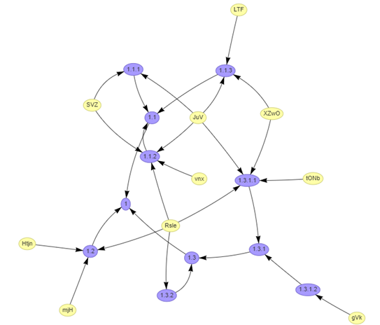
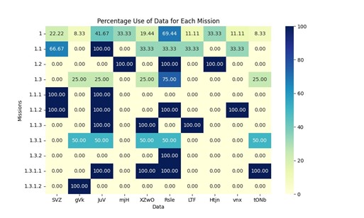
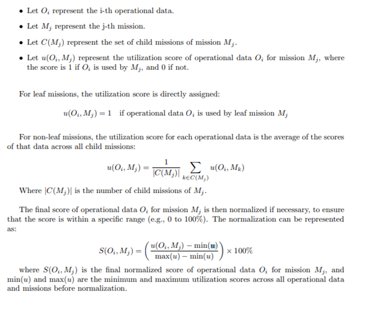
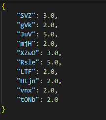
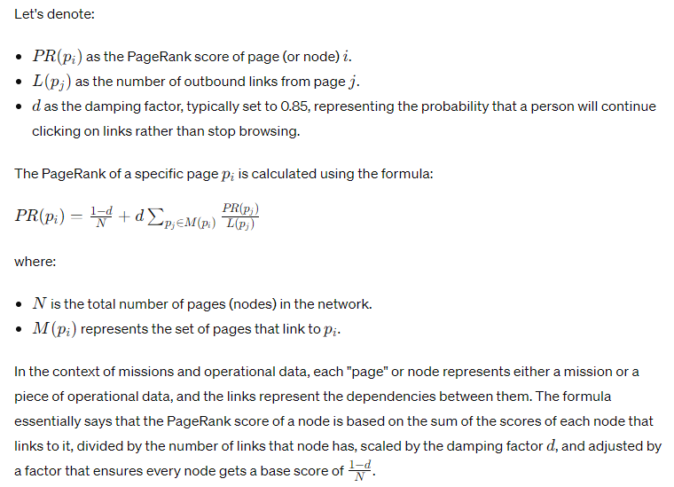

# Overview
Criticality Analysis tool that dehlps determine the "Criticality" (importance) different data elements have to completing missions.

Application utilizes a Python Flask backend for all calculations with a Electrum - NodeJS frontend for the graphical user interface. 

This Criticality Analysis tool will accept data that conforms to the Cyber Data Schema v1.0 and expects the following Objects: Mission, MissionHierarchy, OperationalData, MissionData.

As of 10May24, the tool does not take into account different "importance" rankings for individual missions or multi-tiered Operational Data (in theory a GPS data could be needed for navigation files as well as weapon tract files and this dependency likely has analytical relevancy).

# How To Build
The Electrum application can be built with:
`npm package`

The Python Flask will need to be ran (only locally at this point):
`python app`

# Example Network

# Bottom-Up Analysis

In a bottom-up analysis within a mission-criticality framework, operational data dependencies are evaluated using a quantitative approach. This analysis is designed to capture the extent to which various data elements support the completion of a mission. Starting at the base of the mission hierarchy, each piece of operational data is associated with its direct utilization by leaf missions.

To begin, each leaf mission is assessed to determine its immediate data requirements. The operational data used by these missions are initially scored, reflecting their full contribution to the associated missions. This scoring acknowledges the principle that the data's importance to leaf missions is fundamental and thus given a high percentage score.

Subsequently, the process involves an upward traversal of the mission hierarchy, computing the contribution of operational data to each successive level. At each stage, an average of the scores from the child missions is calculated to reflect the operational data's relevance to the current mission. This averaging process is recursive; it continues iteratively until the top of the hierarchy is reached. This methodology results in a numerical representation of the percentage use of operational data for each mission, indicating the level of dependency.![A close-up of a chart

In this example you can see that mission 1.3.1.2 has a 100% dependency of gVk because it is a direct data requirement. However, this gVk is only a 50% at 1.3.1 because 1.3.1.1 does not require this operational data which means that only 50% of 1.3.1 children require the gVk data. At the 1.3 level, though, this number drops to 25% (not because it is 1 in 4 children) because one child of 1.3 requires the operational data 0% while the other child is 50%.

# Breadth-First and Depth-First Search Analysis

The author made the realization after the fact that this analysis is not interesting as it only results in a “dependency count” due to the nature of the networks where Operational Data are uni-directly pointing to Missions. Hence “Depth” will always be 0. There is an opportunity to improve this analysis methodology and take into account the mathematical properties like centrality of the Missions themselves to drive more refine Operational Data calculations.

The BFS (Breadth-First Search) and DFS (Depth-First Search) analysis offers a way to evaluate the criticality of operational data within a mission's network structure. The methodology assesses each piece of operational data based on its position and connectivity within the graph representing missions and their interdependencies.

The BFS component calculates the 'breadth' or the number of direct successor missions that depend on each piece of operational data. This reflects the immediate influence of the data—how many missions are directly affected if the data were compromised or unavailable.

Conversely, the DFS component calculates the 'depth', which indicates how far down the data influences the mission hierarchy. Data with greater depth can be critical in the long term, affecting the mission outcomes at multiple levels.

In practice, the BFS and DFS scores are combined to derive a composite score of criticality for each piece of operational data, balancing their immediate and extended impact on the mission structure.

For the given data values:

SVZ: 3.0: This suggests that SVZ directly influences three missions (breadth) and could have cascading effects down the mission hierarchy (depth). Its criticality is moderate, implying that while not ubiquitous, it plays a significant role where it is used.

mjH, XZwO, LTF, Htjn, vnx, tONb: 2.0: All of these operational data have the same score, suggesting a similar level of criticality. They directly impact two missions, which means their influence is more localized but still essential for the specific missions they support.

In conclusion, the BFS/DFS analysis provides a nuanced understanding of the criticality of operational data. It enables mission planners to identify both the data that must be immediately secured due to its broad and direct influence on the mission network, as well as the data that, while perhaps not as widely used, supports the deeper and more strategic aspects of the mission structure.

# Page Rank Analysis

The PageRank algorithm, a concept originated by Google's founders, is used to determine the relative importance of various nodes within a network. When applied to the context of mission-criticality analysis, PageRank can help us understand which missions or operational data points hold the most significance in terms of their influence on the overall network.

In a directed graph where nodes represent missions and edges represent the flow of operational data dependencies, PageRank assigns a numerical weighting to each node, with higher values indicating more significant nodes. The premise is that a node is considered important if it is referenced (or connected to) by other important nodes.

For the provided PageRank results:

SVZ: The PageRank score of 0.09364 for operational data "SVZ" in relation to Mission "1" suggests that "SVZ" is moderately influential. It doesn't have the highest PageRank score but does have a noteworthy level of importance within the network due to either being relied upon by important missions or being involved in a fair number of mission dependencies.
gVk: The PageRank score of 0.09651 for "gVk" in the context of Mission "1" is close to that of "SVZ," indicating a similar level of importance within the network structure. However, "gVk" is not used at all in Mission "1.1" as its score is 0, meaning that its influence might be more significant in different parts of the network.
When analyzing PageRank in the context of mission criticality, the focus is not just on which operational data has the highest score but on understanding the topology of the network's dependencies. A high PageRank score for an operational data node in this context indicates that it plays a key role in the functionality of several interconnected missions.

The PageRank results provide actionable insights into which operational data points are most vital to the resilience and success of the overall mission structure. Stakeholders can use this information to prioritize efforts in safeguarding critical data, ensuring that resources are allocated effectively, and identifying potential points of failure within the network that could compromise mission success.

